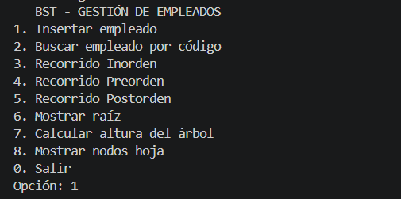

# Árbol BST Empresarial en C++

## Objetivo

Implementar un Árbol Binario de Búsqueda (BST) en C++ para organizar empleados de una empresa utilizando un código como clave principal.

## Descripción

Este proyecto consiste en desarrollar una estructura de datos tipo BST que permita almacenar y gestionar empleados dentro de una empresa de forma jerárquica.

Cada empleado contiene:

* Código
* Nombre
* Cargo

El sistema permite realizar operaciones básicas como inserción, búsqueda y recorridos del árbol.

## Funcionalidades

* Insertar empleados
* Buscar empleados por código
* Mostrar la raíz del árbol
* Recorrido inorden
* Recorrido preorden
* Recorrido postorden
* Calcular la altura del árbol
* Mostrar nodos hoja

## Estructura del proyecto

```
arbol-bst-empresa-cpp/
│
├── src/
│   └── main.cpp
│
├── capturas/
│
└── README.md
```

## Cómo ejecutar el programa

### Compilar

```
g++ main.cpp -o arbol
```

### Ejecutar

En Linux / Mac:

```
./arbol
```

En Windows:

```
arbol.exe
```

## Datos de prueba sugeridos

| Código | Nombre           | Cargo        |
| ------ | ---------------- | ------------ |
| 50     | Empresa UTA      | Raíz         |
| 30     | Gerente Ventas   | Nodo interno |
| 70     | Gerente Finanzas | Nodo interno |
| 20     | Empleado 1       | Hoja         |
| 40     | Empleado 2       | Hoja         |
| 60     | Empleado 3       | Hoja         |
| 80     | Empleado 4       | Hoja         |

## Conceptos básicos

* **Raíz:** Es el primer nodo del árbol (el nodo principal).
* **Nodo:** Cada elemento dentro del árbol.
* **Hoja:** Nodo que no tiene hijos.
* **Altura:** Número de niveles del árbol.

## Capturas

Agregar imágenes de:



## Conclusión

El uso de árboles BST permite organizar información de manera eficiente, facilitando búsquedas rápidas y una estructura jerárquica clara.

## Evidencia

* Código funcional en C++
* Capturas de ejecución
* Participación del equipo mediante commits en GitHub
